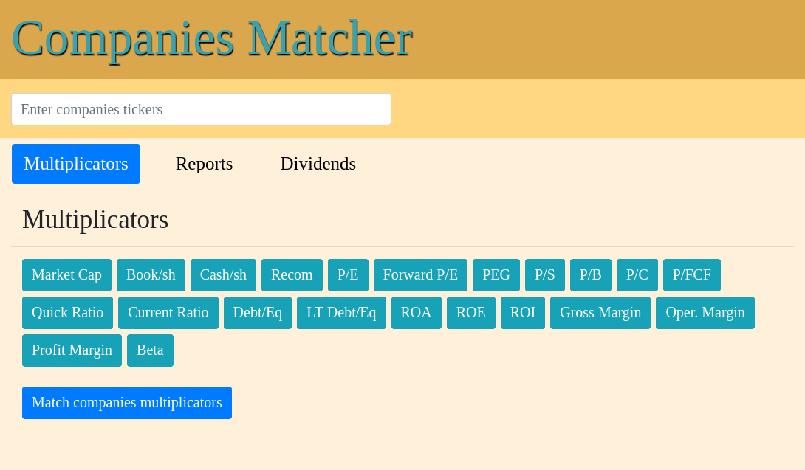
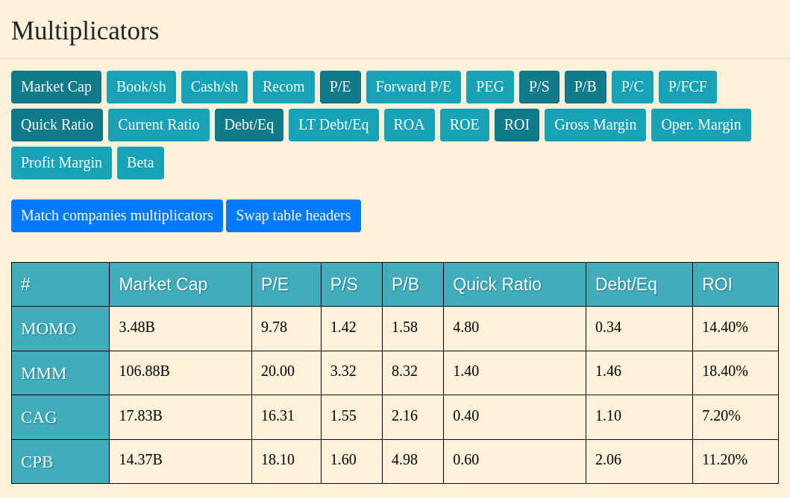
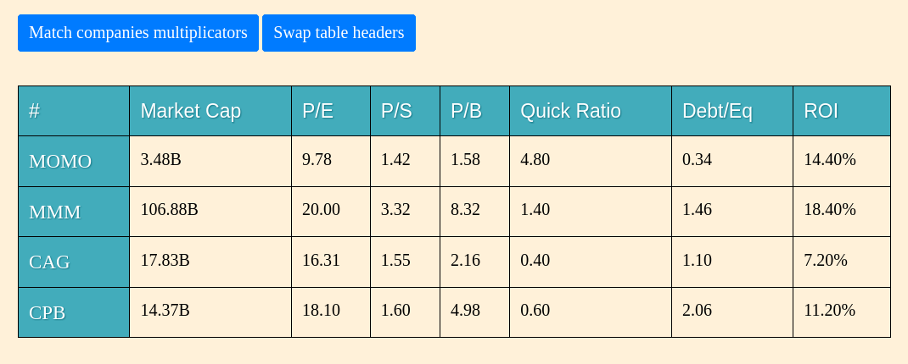
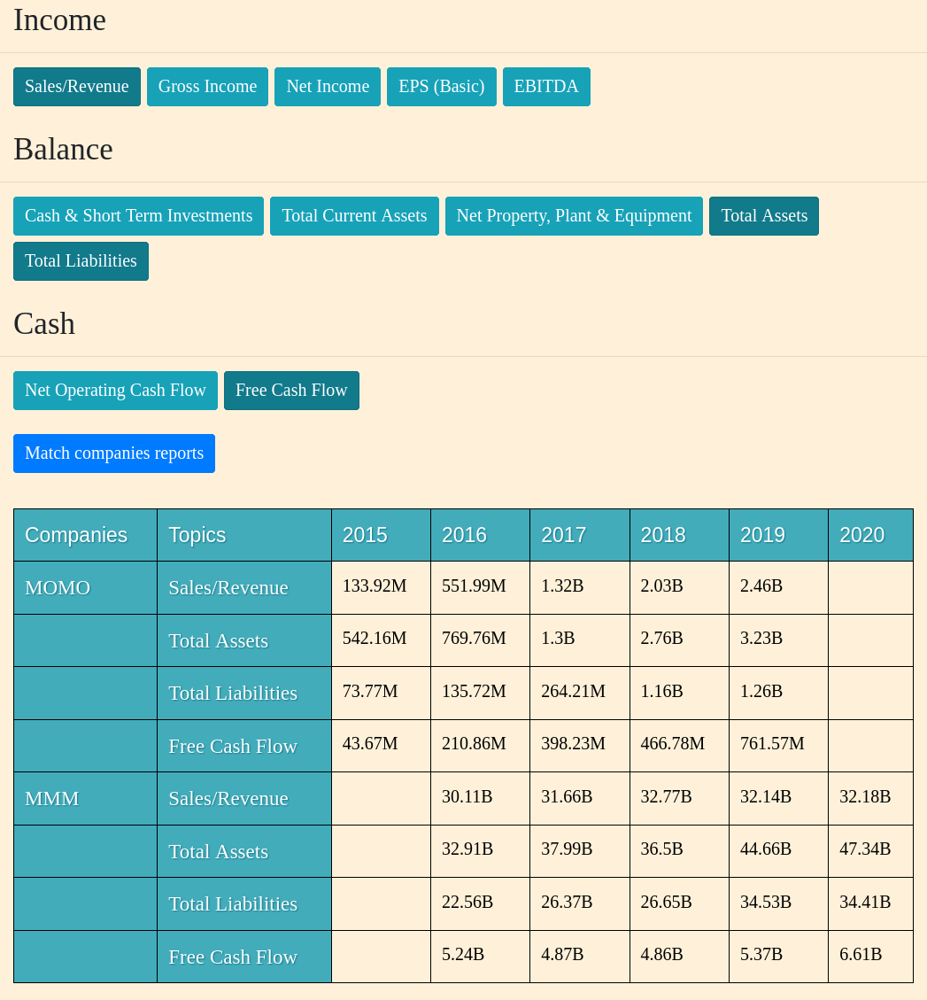
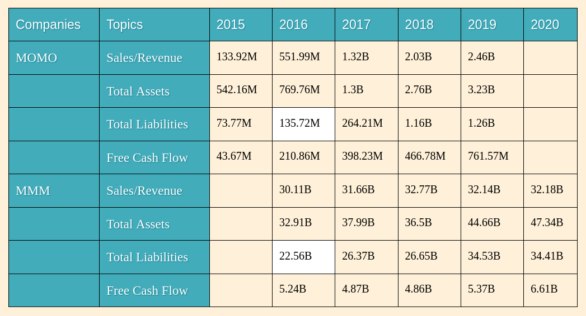
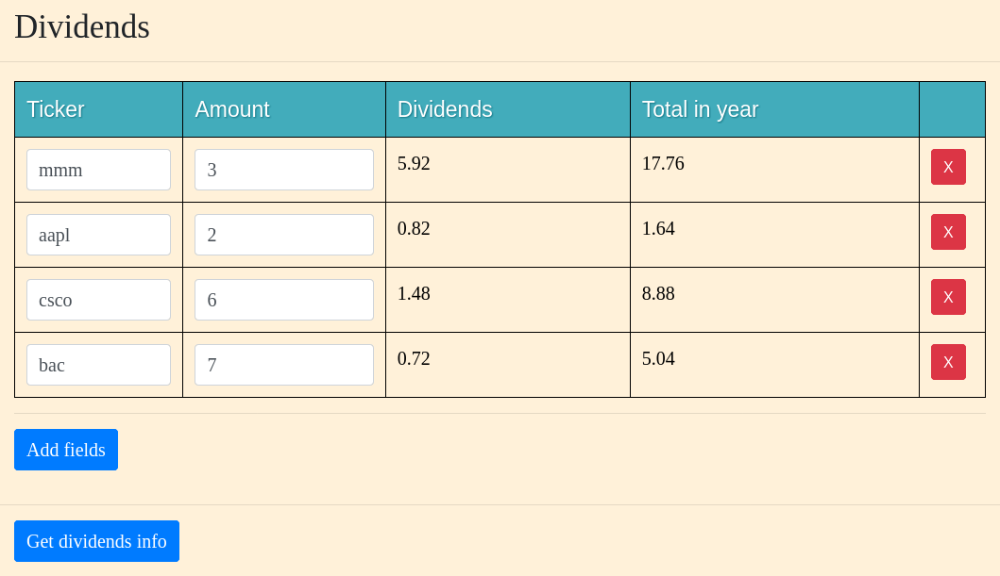

# Companies Matcher

**Companies Matcher** is the web app helping you to analyze companies for investitions.



### Description
There are three windows which can be used to analyze company by some parameters:
1. **Multiplicators** - some financial and other company indicators.
2. **Reports** - company year reports.
3. **Dividends** - information about company dividends.


### Multiplicators
Ticker field and multiplicators buttons must be filled to see information about companies.



For comfortable table view is can be swap headers by click the button **Swap table headers**



### Reports
It allow to combine some topics from different parts companies reports to one consolidated report.



Also there is a feature for more comfortable data view. Just click in any cell and every cell with same topic will be colored.



### Dividends
In this table you can get information about companies dividends.




### Start

App can be start from docker
```shell script
sudo docker build -t companies_matcher .
sudo docker run -p 5000:5000 companies_matcher
```

Local by yourself
```shell script
uvicorn companies_matcher.app.main:app --host 0.0.0.0 --port 5000 --reload
```
